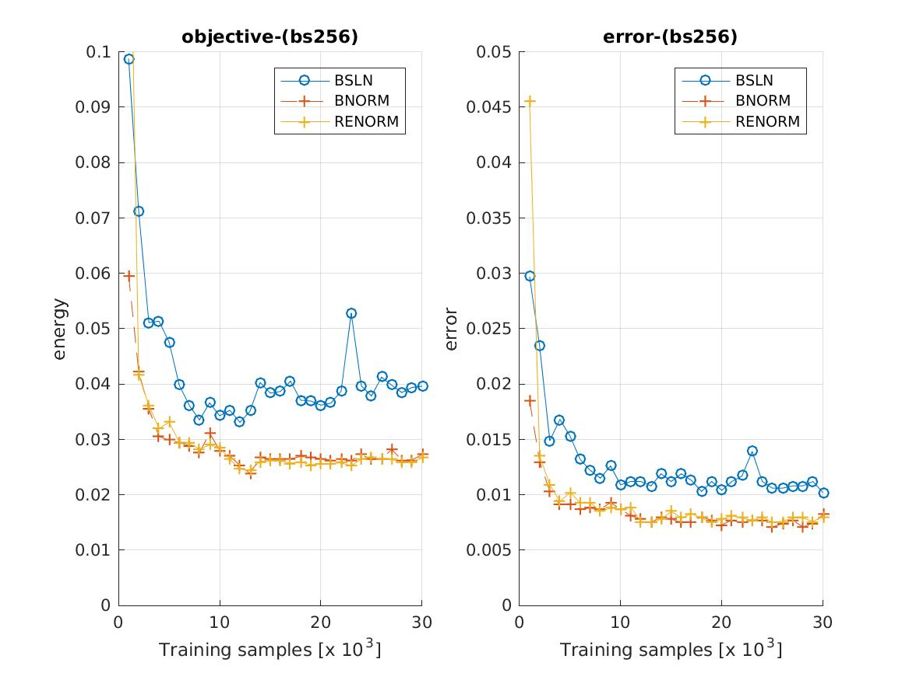
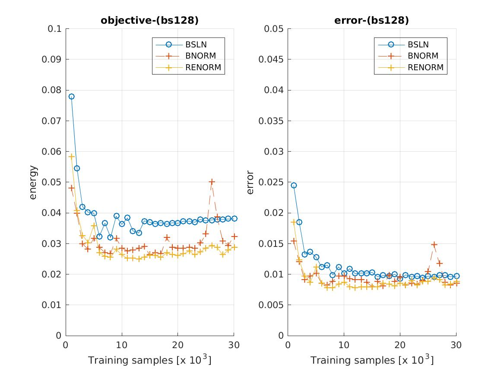
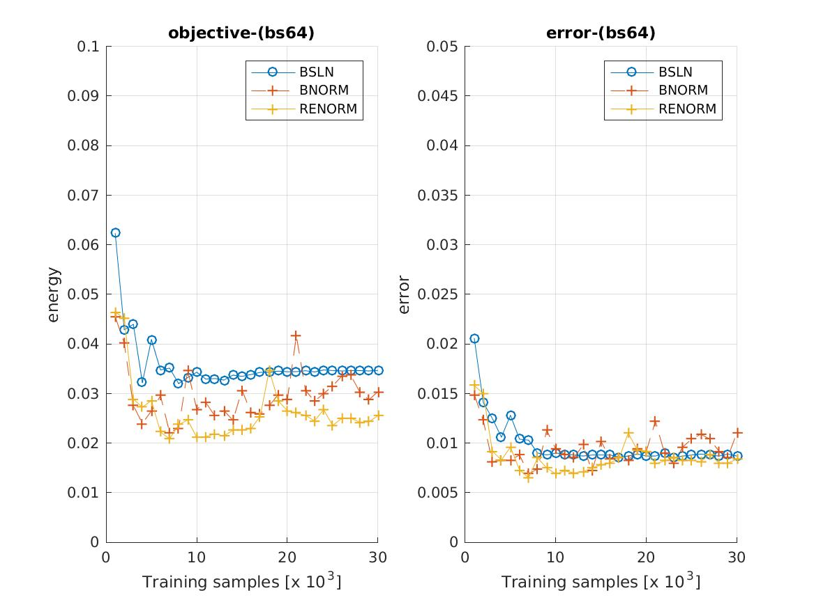
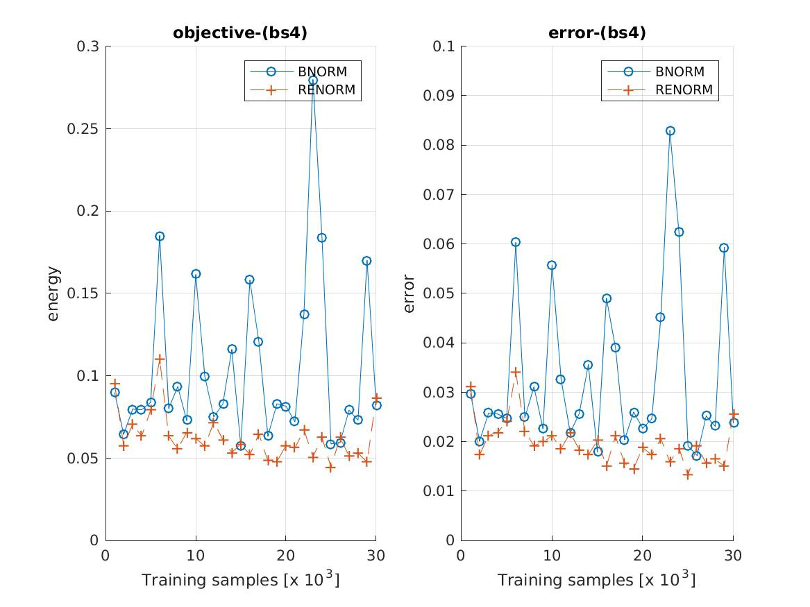

## Batch Renormalization

This module provides some code to experiment with batch renormalization, 
as described in the [paper](https://arxiv.org/abs/1702.03275):

```
Batch Renormalization: Towards Reducing Minibatch Dependence in Batch-Normalized Models
By Sergey Ioffe, arXiv preprint arXiv:1702.03275 (2017)
```


### Install

The module is easiest to install with the `vl_contrib` package manager:

```
vl_contrib('install', 'mcnBReNorm') ;
vl_contrib('setup', 'mcnBReNorm') ;
```

The example experiments use the [autonn](https://github.com/vlfeat/autonn) 
module (although this is not required to use the `vl_nnbrenorm` function), 
which can be installed as follows:

```
vl_contrib('install', 'autonn') ;
vl_contrib('setup', 'autonn') ;
```

### Experiments

To explore the effect of batch renormalization, we can run some simple experiments on MNIST. In the original paper ImageNet is used (so MNIST experiments should be taken with an appropriately large bucket of salt).

The initial goal is to reproduce the first experiment in the paper i.e. that batch renormalization does not perform worse than standard batch normalization when training with reasonably large batch sizes.

In the experiment below, we train three simple networks - one with no feature normalization, one with batch normalization and one with batch renormalization.
The networks are trained with a batch size of `256`. Batch renormalization uses the parameters recommended by the paper (e.g. an `alpha = 0.01` - see `example/mnist_renorm_experiment1.m` for the details). The results seem to support the claim of the paper.



Next we drop the batch size to `128` and we see renormalization hinting at a 
modest improvement over standard batch normalization, but we also see that the
advantages of normalizing have been reduced.



Dropping the batch size further to `64`, we see this effect repeated:



We can take this to an extreme by dropping the batch size all the way down 
to `4`.  At this batch size, the baseline no longer converges with the same 
learning rate so it is left out of the comparison. This is one of the intended 
use cases for batch renorm, and it seems to offer some additional stability 
here:



Just as a final note, once the values of `r` and `d` have been relaxed (see 
below for explanation of notation), batch nenormalization occasionally 
exhibits slightly pathological behaviour, particularly on small batches when 
there is a large difference between the statistics of the minibatch and the 
rest of the training set (see an example of training with a batch size of `32` 
below).  These could probably be addressed with more a more careful tuning of 
`alpha` and the learning rates of the network:


### Notes

The motivation for *batch renormalization* is to fix the issues that batch 
normalization can exhibit when training with small minibatches (or 
minibatches which do not consist of independent samples). Recall that to perform 
[batch normalization](https://arxiv.org/abs/1502.03167), features are normalised 
with using the statistics of the *current minibatch* during training:

```
Batch Normalization:

x_hat_i = (x_i - mu_B) / sigma_B
y_i = gamma * x_hat_i + beta

where
  gamma   := per-channel gain
  beta    := per-channel bias
  mu_B    := minibatch mean
  sigma_B := minibatch standard deviation
```

To perform batch renormalization we make a small modification to this approach 
by normalizing instead with a mixture of the minibatch statistics *and* a 
rolling estimate of the feature statistics over many minibatches:


```
Batch Renormalization:

x_hat_i = ((x_i - mu_B) / sigma_B) * r + d
y_i = gamma * x_hat_i + beta

where 
  r     := mu_B / mu
  d     := (mu_B - mu) / sigma
  mu    := rolling average of minibatch mean
  sigma := rolling average of minibatch standard deviation 
  
```

The goal of these additional terms is to reduce the dependence of the 
normalisation on the current minibatch. If `r = 1` and `d = 0`, then batch 
renormalization simply performs standard batch normalization. In practice, 
the values of `r` and `d` can jump around quite a lot, particularly near the 
start of training.  The solution proposed in the paper is to clip these values:

```
r := clip( mu_B / sigma, [1/r_max, r_max])
d := clip( (mu_B - mu) / sigma, [-d_max, d_max])

where
  clip(x, [a b]) := max(min(x, b), a)
  r_max          := a hyperparameter chosen to constrain r
  d_max          := a hyperparameter chosen to constrain d
```

During training, the layer is initialised with `r_max = 1, d_max = 0` 
(matching standard batch norm). These values are gradually relaxed over time.
