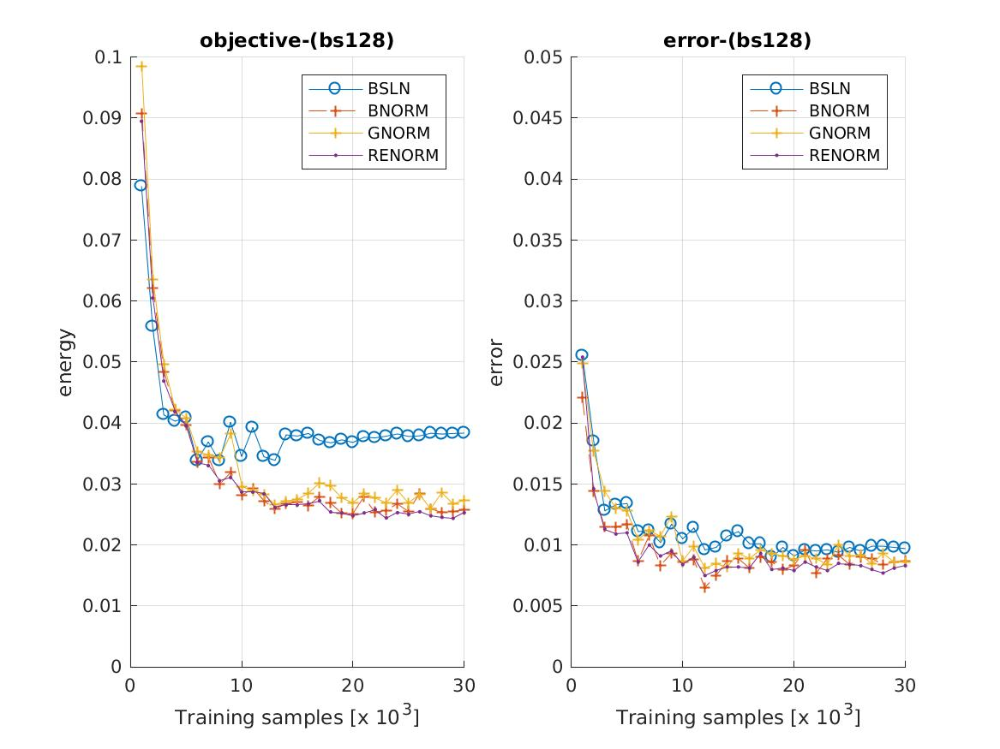

## Group Normalization

This module provides some code to experiment with group normalization, as described in the [paper](https://arxiv.org/abs/1803.08494), and to compare it with some other normalization methods with simple experiments.

```
Group Normalization, Yuxin Wu, Kaiming He,
arXiv preprint arXiv:1803.08494 (2018)
```

### Install

The module is easiest to install with the `vl_contrib` package manager:

```
vl_contrib('install', 'mcnGroupNorm') ;
vl_contrib('setup', 'mcnGroupNorm') ;
```

The implementation of the `vl_nngnorm` function, together with an implementation of batch renormalization can be found in [mcnExtraLayers](https://github.com/albanie/mcnExtraLayers).  The example experiments use the [autonn](https://github.com/vlfeat/autonn) module (although this is not required to use the `vl_nngnorm` function).


```
vl_contrib('install', 'mcnExtraLayers') ;
vl_contrib('setup', 'mcnExtraLayers') ;
vl_contrib('install', 'autonn') ;
vl_contrib('setup', 'autonn') ;
```

### Experiments

To explore the effect of group normalization, we can run some simple experiments on MNIST and compare with competing approaches to feature normalization (here we compare vs batch normalization and batch renormalization). In the original paper ImageNet is used (so MNIST experiments should be taken with an appropriately large bucket of salt).  The experiments below are based on modifying a simple LeNet (see [mnist\_feat\_norm.m](example/mnist_feat_norm.m) for architecture configuration).

In all experiments, the baseline (no feature normalization, minibatch size `256`) is trained with a learning rate of `0.001` (higher learning rates tend to cause the gradients to become unstable), while each feature normalized method uses a learning rate of `0.01`.  As the batch size is reduced, the learning rate is scaled linearly, following the approach described [here](https://arxiv.org/abs/1706.02677). It's certainly possible to obtain better performance than reported here with better hyperparam tuning, but the general purpose of these experiments is to get a sense of the stability of the methods.  Batch renormalization uses the parameters recommended by the paper (e.g. an `alpha = 0.01` - see `example/mnist_feat_norm_exp1.m` for the details).

As a more general note, these experiments are fairly preliminary so may contain mistakes (corrections are welcome).

### Batch size 256

Each of the feature normalization methods perform comparably aagainst the unnormalized baseline, which supports the claim that group norm can achieve similar performance to batch norm at moderate batch sizes.


### Batch size 128

Next we drop the batch size to `128` and we see renormalization hinting at a modest improvement over standard batch normalization, but we also see that the advantages of normalizing have been reduced.



### Batch size 64

Dropping the batch size further to `64`, we see this effect repeated:


### Batch size 32


### Batch size 16

The baseline tends to diverge, unless the learning rate is extremely low.


### Batch size 4

In the "very small" minibatch regime, batch normalization soon becomes unstable.  This is the problem that batch renormalization was designed to fix. Group norm remains stable.


### Batch size 2

At a batch size of 2, under the learning parameters described above, only group norm converges (the gradients of the other networks explode on the first epoch).


### Batch size 1

The same is true at a batch size of 1 (note that to save time, these networks were only trained for `10` epochs).


### Notes for group normalization

The implementation is fairly simple (code [here](https://github.com/albanie/mcnExtraLayers/blob/master/matlab/vl_nngnorm.m)).  The details are described in [this paper](https://arxiv.org/abs/1803.08494).

### Notes for batch renormalization

The motivation for *batch renormalization* is to fix the issues that batch normalization can exhibit when training with small minibatches (or minibatches which do not consist of independent samples). Recall that to perform [batch normalization](https://arxiv.org/abs/1502.03167), features are normalised with using the statistics of the *current minibatch* during training:

```
Batch Normalization:

x_hat_i = (x_i - mu_B) / sigma_B
y_i = gamma * x_hat_i + beta

where
  gamma   := per-channel gain
  beta    := per-channel bias
  mu_B    := minibatch mean
  sigma_B := minibatch standard deviation
```

To perform batch renormalization we make a small modification to this approach by normalizing instead with a mixture of the minibatch statistics *and* a rolling estimate of the feature statistics over many minibatches:


```
Batch Renormalization:

x_hat_i = ((x_i - mu_B) / sigma_B) * r + d
y_i = gamma * x_hat_i + beta

where
  r     := mu_B / mu
  d     := (mu_B - mu) / sigma
  mu    := rolling average of minibatch mean
  sigma := rolling average of minibatch standard deviation

```

The goal of these additional terms is to reduce the dependence of the normalisation on the current minibatch. If `r = 1` and `d = 0`, then batch renormalization simply performs standard batch normalization. In practice, the values of `r` and `d` can jump around quite a lot, particularly near the start of training.  The solution proposed in the paper is to clip these values:

```
r := clip( mu_B / sigma, [1/r_max, r_max])
d := clip( (mu_B - mu) / sigma, [-d_max, d_max])

where
  clip(x, [a b]) := max(min(x, b), a)
  r_max          := a hyperparameter chosen to constrain r
  d_max          := a hyperparameter chosen to constrain d
```

During training, the layer is initialised with `r_max = 1, d_max = 0` (matching standard batch norm). These values are gradually relaxed over time.
